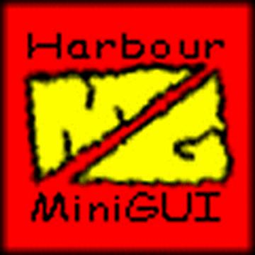

# Third-party Tools and Libraries

These are some links to Harbour related 3rd party products.

## Categories:

* [GUI — Free and Open Source](#gui--free-and-open-source)
* [GUI — Commercial](#gui--commercial)
* [RDD](#rdd)

---

# GUI — Free and Open Source

## [HwGUI](https://sourceforge.net/projects/hwgui/)

<i class="fa fa-desktop large-icon" aria-hidden="true"></i>
Is a cross-platform GUI library for Harbour, it is written in C and Harbour.

HwGUI includes two versions: Windows and Linux. Windows version is based on
direct calls of win32 API — this allows to keep it quite fast and compact.
Linux version is based on GTK, it supports the same set of classes, commands
and functions as the Windows version, though not all yet. Thus, using some
base subset of HwGUI, you can create crossplatform GUI applications.

Currently the Windows version of HwGUI supports these C compilers: MinGW, MS
Visual C, Borland C, Pelles C and Open Watcom C.

## [MiniGUI](https://sites.google.com/site/hmgweb/)

Harbour MiniGUI (HMG) is an xBase Windows / GUI Development System based
on Harbour MiniGUI library, Harbour MiniGUI IDE, Harbour compiler and MinGW
compiler. This implements a semi-OOP model and is a ready to use Harbour
distribution who include all needed components for your work.

[Project page](https://sourceforge.net/projects/harbourminigui/). 
MiniGUI [unofficial build](http://www.hmgextended.com/) with _extended_ features.

## [ooHG](https://sourceforge.net/projects/oohg/)

Object-Oriented Harbour Graphical interface. This is an object-oriented style
conversion from the MiniGUI's library. Supporting existing code, and adding new
and powerful advantages of the object oriented programming.

It offers a great flexibility for the well-know MiniGUI functionality, and an
easy way to add new features with the lesser affectation to working code (anyone
can subclass any control and add its own features to it).

## [wxHarbour](https://sourceforge.net/projects/wxharbour/)

wxHarbour is a set of Harbour language bindings for wxWidgets. Providing
a portable multi-platform GUI toolkit for Harbour.

wxWidgets lets developers create applications for Windows, macOS, GTK+, X11,
Motif, and more using one codebase. Unlike other cross-platform toolkits,
wxWidgets applications look and feel native. This is because wxWidgets uses
the platform's own native controls rather than emulating them. It's also
extensive, free, open-source, and mature.

## [HBwxW](http://harbour.fm.interia.pl/)

HBwxW is a multiplatform GUI library for Harbour. It is built on top of
wxWidgets platform GUI library, available on Unix like systems, Windows,
macOS operating systems. wxWidgets is "An open source C++ GUI framework to make
cross-platform programming child's play".

The main goal of HBwxW is to provide an easy to use GUI library, which can be
utilized on all platforms Harbour currently supports. That's why it is based on
a library which gives you a single, easy-to-use API for writing GUI applications
on multiple platforms.

HBwxW, like its underlying GUI library, is powerful and efficient enough to
realize the most common tasks, as expected by the average and advanced
programmers. Its main advantage over other GUI libraries is the 'native look and
feel' on all supported platforms, simplyfying application usage and giving users
the same sense of comfort they are already used to.

## [xbGTK](http://xbgtk.sourceforge.net/)

xbGTK is an open source library for Linux and Windows. It allows to use GTK+ in
programs written in xBase-like languages. The library is written by Phil Krylov.
It is based on the PyGTK — Project by James Henstridge. Some files are modified,
though, to generate proper xBase code (instead of Python).

## [xHGtk](http://xhgtk.sourceforge.net/)

xHGtk is an multiplataform GUI library for Harbour. Use GTK+ to create programs
that can run in Windows and Linux. It provides a library of commands, functions
and classes for multiplatform development using Harbour, MinGW graphics library
and GTK + 2.10 or higher.

## [T-Gtk](https://sourceforge.net/projects/t-gtk/)

GUI for Harbour toolkit for GTK+. This library allows to give the compilers of
Harbour from the full power of GTK + Cross-platform.

---

# GUI — Commercial

## [FiveWin for Harbour (FWH)](http://www.fivetechsoft.com/english/fwh.html)

FiveWin was originally a library for Clipper 5 which you use in exactly the same
way that you have been using other third party libraries in Clipper. The main
difference is that FiveWin lets you build executables that run as REAL Windows
GUI Programs.

You have all the power of Windows and its environment at your fingertips! Only
downside of the FiveWin for Clipper… it's still 16-bit. Now FiveTech Software
has managed to make the library work with Harbour.

## [Visual Report designer for Harbour/FiveWin](http://www.reportdesigner.info)

EasyReport provides every Harbour/FiveWin user a simple and fast way to add a
visual report designer to his/her applications. EasyReport is flexible,
cost-effective, multilingual and you can give the visual designer to all of your
end users without paying anything extra (royalty free).

EasyReport supports up to 100 areas with 1000 items each. The possible item
types are Text, Image (supports 8 different image file formats), Graphic (f.e.
lines, rectangles, ellipses) and Barcodes.

## [Xailer](http://www.xailer.com/)

Xailer is a complete visual development environment for xBase users, following
the guide lines of other already existing programming environments (Delphi,
Visual Basic, …). As any other complete visual environment includes:

* Form designer
* Professional Source code editor
* Property inspector
* Project manager
* Report generator
* Resource manager
* Integrated Debugger

And all these features are built over a unique interface, which is tremendously
intuitive and permits the development of any project in record time.

---

# RDD

## [OTC Mediator RDD for Harbour](http://www.otc.pl/en/harbour.html)

OTC Mediator is RDD driver for PostgreSQL, Microsoft SQL Server, Oracle and
MySQL was designed to allow quick migration of DBF data and xBase applications
to one of the mentioned databases. It implements all RDD features required for
easy migration including RECNO record numbers, DELETED flag, Clipper-compatible
record and file locks as well as complex expression indexes.

Basically, Mediator package consists of three parts:

* Set of utilities facilitating data (DBF) and index (NTX, CDX) migration to
  RDBMS
* Libraries implementing RDD interface to be linked into Harbour or Clipper
  application
* Mediator server translating application requests into SQL commands sent to
  database

## [Sybase Advantage Server for Harbour](https://www.sap.com/pc/tech/database/software/advantage-database-server/index.html)

Harbour has native support for Sybase Advantage Database Server, a
high-performance client/server RDBMS for stand-alone, networked, internet and
mobile database applications. Advantage Database Server allows developers the
high-performance and control of navigational commands combined with optimized
data access methodology for easily delivering unparalleled performance, Advantage
provides security, stability and data integrity while being completely
maintenance-free.

With no mandatory configuration requirements, Advantage is easily installed on
an existing network infrastructure. Because of the embedded qualities of
Advantage, it works tirelessly behind the application, delivering client/server
performance, stability, and data integrity that today's business applications
demand.
